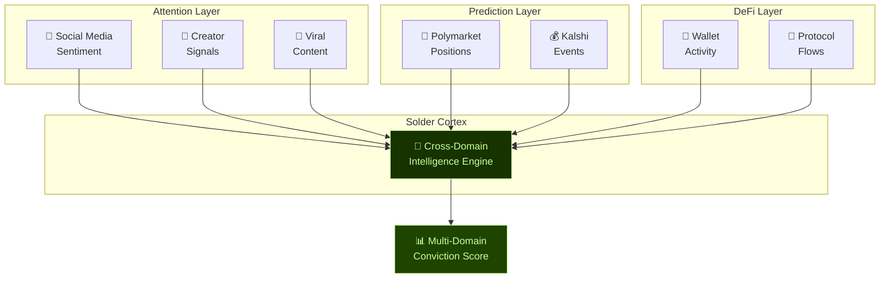

<style>
:root {
  --slidev-theme-primary: #C9FF99;
  --slidev-theme-background: #163300;
}
.slidev-layout {
  background: linear-gradient(135deg, #163300, #0f2200);
}
</style>

# 🤘 Solder Cortex

### Cross-Domain Intelligence Layer

**Attention Markets • Prediction Markets • DeFi**

<div class="pt-12">
  <span class="px-4 py-2 rounded" style="background: linear-gradient(to right, #163300, #1e4400); border: 1px solid #C9FF99; color: #C9FF99; font-weight: bold;">
    Colosseum Agent Hackathon 2026
  </span>
</div>

<div class="abs-br m-6 flex gap-2">
  <a href="https://github.com/metalmcclaw/solder-cortex" target="_blank" 
    class="text-xl slidev-icon-btn opacity-50 !border-none hover:opacity-100" style="color: #C9FF99;">
    <carbon-logo-github />
  </a>
</div>

---
transition: fade-out
layout: center
---

# 🌊 The $500B Intelligence Gap

<v-clicks>

### **Attention flows BEFORE money flows**

But AI agents can't see the signals that matter most

</v-clicks>

---
layout: two-cols
---

# The Missing Intelligence Layer

<v-clicks>

- 🎪 **$100B+ Creator Economy** drives market sentiment
- 📱 **Social signals precede** market movements by 45+ minutes  
- 🤖 **Agent-managed capital** needs cross-domain intelligence
- 💰 **Attention → Prediction → DeFi** cascade is invisible to agents
- ❓ **Who's getting the intelligence FIRST?**

</v-clicks>

::right::

<div class="flex items-center justify-center h-full">

<div class="p-6 rounded-lg" style="background: rgba(239,68,68,0.1); border: 2px solid #ef4444;">

### 💸 The Blind Spot

<div class="text-xl mt-4">

**Viral TikTok about crypto**

↓

**Prediction market odds shift**

↓ 

**DeFi volume explodes**

↓

**Agent sees transaction AFTER**

</div>

<div class="text-sm mt-4 text-center font-bold" style="color: #ef4444;">
Missing the attention signal = No edge
</div>

</div>

</div>

---
layout: center
class: text-center
---

# 💡 The Multi-Domain Insight

<div class="text-2xl mt-8">

> "If a creator **posts bullish content**, then **bets YES**, then **buys the dip**...
>
> they're putting their **attention, prediction, AND money** where their conviction is."

</div>

<v-click>

<div class="text-xl mt-8 font-bold" style="color: #C9FF99;">
This is MAXIMUM CONVICTION. 🚀
</div>

</v-click>

---
layout: center
---

# 🔮 Introducing Solder Cortex 2.0

<div class="grid grid-cols-3 gap-6 mt-8">

<div class="p-6 rounded-lg border" style="background: linear-gradient(to bottom right, rgba(22,51,0,0.8), rgba(30,68,0,0.5)); border-color: rgba(201,255,153,0.3);">

### 🎪 Attention Markets

<v-clicks>

- Creator conviction scoring
- Viral content detection  
- Cross-platform sentiment
- Attention flow prediction

</v-clicks>

</div>

<div class="p-6 rounded-lg border" style="background: linear-gradient(to bottom right, rgba(15,34,0,0.8), rgba(22,51,0,0.5)); border-color: rgba(201,255,153,0.3);">

### 🎲 Prediction Markets

<v-clicks>

- Real-time positions
- Market trend analysis
- Conviction scoring
- Anomaly detection

</v-clicks>

</div>

<div class="p-6 rounded-lg border" style="background: linear-gradient(to bottom right, rgba(30,68,0,0.8), rgba(15,34,0,0.5)); border-color: rgba(201,255,153,0.3);">

### 💰 DeFi Markets

<v-clicks>

- Wallet behavior analysis
- Position tracking
- Flow correlation
- Alpha identification

</v-clicks>

</div>

</div>

---
layout: center
---

# ⚙️ The Unified Intelligence Engine


```mermaid {scale: 0.8}
graph TD
    subgraph "Attention Layer"
        A1[📱 Social Media<br/>Sentiment]
        A2[👥 Creator<br/>Signals]
        A3[🚀 Viral<br/>Content]
    end
    
    subgraph "Prediction Layer"  
        P1[🎲 Polymarket<br/>Positions]
        P2[💰 Kalshi<br/>Events]
    end
    
    subgraph "DeFi Layer"
        D1[💎 Wallet<br/>Activity] 
        D2[🔄 Protocol<br/>Flows]
    end
    
    subgraph "Solder Cortex"
        C[🧠 Cross-Domain<br/>Intelligence Engine]
    end
    
    A1 --> C
    A2 --> C
    A3 --> C
    P1 --> C
    P2 --> C
    D1 --> C
    D2 --> C
    
    C --> E[📊 Multi-Domain<br/>Conviction Score]
    
    style C fill:#163300,stroke:#C9FF99,color:#C9FF99
    style E fill:#1e4400,stroke:#C9FF99,color:#C9FF99
```

---

# 🔬 How Cross-Domain Conviction Works

<div class="grid grid-cols-3 gap-4 mt-6">

<div class="p-4 rounded text-center" style="background: rgba(239,68,68,0.2); border: 1px solid rgba(239,68,68,0.5);">

### ❌ Low Conviction

<div class="text-sm mt-4">

**Social:** Posts bearish content

**Prediction:** Bets YES on rally  

**DeFi:** Selling positions

</div>

<div class="mt-4 font-bold" style="color: #ef4444;">
Score: 0.1 - Contradictory
</div>

</div>

<div class="p-4 rounded text-center" style="background: rgba(234,179,8,0.2); border: 1px solid rgba(234,179,8,0.5);">

### ⚠️ Medium Conviction

<div class="text-sm mt-4">

**Social:** Silent on markets

**Prediction:** Bets YES on rally

**DeFi:** Small position increase

</div>

<div class="mt-4 font-bold" style="color: #eab308;">
Score: 0.6 - Partial Alignment
</div>

</div>

<div class="p-4 rounded text-center" style="background: rgba(201,255,153,0.2); border: 1px solid rgba(201,255,153,0.5);">

### ✅ Maximum Conviction

<div class="text-sm mt-4">

**Social:** Viral bullish content

**Prediction:** Large YES bets

**DeFi:** Heavy accumulation

</div>

<div class="mt-4 font-bold" style="color: #C9FF99;">
Score: 0.98 - Full Alignment
</div>

</div>

</div>

---
layout: two-cols
---

# 🛠️ Technical Architecture

<v-clicks>

### Expanded Components

- **cortex-core** - Rust conviction engine
- **Unified MCP Server** - 20 tools total
- **Attention Module** - Social signal processing
- **Prediction APIs** - Polymarket + Kalshi
- **Real-time pipeline** - Multi-domain scoring

</v-clicks>

::right::

<div class="ml-4">

```rust
// attention.rs
pub struct AttentionSignal {
    pub platform: Platform,
    pub engagement_velocity: f64,
    pub creator_track_record: f64,
    pub sentiment_alignment: f64,
    pub viral_potential: f64,
}

// Enhanced conviction engine
impl ConvictionEngine {
    pub fn analyze_cross_domain(
        &self,
        attention: &[AttentionSignal],
        positions: &[PolymarketPos],  
        defi_txs: &[DeFiTx],
    ) -> ConvictionScore {
        // Triple-domain correlation
        // ...
    }
}
```

</div>

---

# 🔌 MCP Server - 20 Tools Across 3 Domains

<div class="grid grid-cols-3 gap-4 mt-4 text-sm">

<div>

**🎪 Attention Tools (7)**
- `attention_get_trending_topics`
- `attention_analyze_creator_sentiment`  
- `attention_cross_correlate`
- `attention_viral_content_analysis`
- `attention_get_creator_conviction`
- `attention_get_market_signals`
- `attention_analyze_flow`

</div>

<div>

**🎲 Prediction Tools (6)**
- `cortex_get_market_trend`
- `cortex_get_volume_profile` 
- `cortex_search_market_memory`
- `cortex_detect_anomalies`
- `cortex_get_wallet_conviction`
- `cortex_detect_informed_traders`

</div>

<div>

**💰 DeFi Tools (7)**
- `cortex_get_wallet_summary`
- `cortex_get_wallet_pnl`
- `cortex_get_wallet_positions`
- `cortex_start_indexing`
- `cortex_stop_indexing`  
- `cortex_list_subscriptions`
- `cortex_health`

</div>

</div>

---
layout: center
---

# 📊 Expanded Market Opportunity

<div class="grid grid-cols-3 gap-8 mt-8">

<div class="text-center p-6 rounded-lg" style="background: rgba(22,51,0,0.5); border: 1px solid rgba(201,255,153,0.5);">

### 🎪 Creator Economy

<div class="text-3xl font-bold mt-4" style="color: #C9FF99;">$100B+</div>
<div class="text-sm mt-2">Creator economy value</div>
<div class="text-xs mt-1">Attention drives everything</div>

</div>

<div class="text-center p-6 rounded-lg" style="background: rgba(22,51,0,0.5); border: 1px solid rgba(201,255,153,0.5);">

### 🎲 Prediction Markets

<div class="text-3xl font-bold mt-4" style="color: #C9FF99;">$50B+</div>
<div class="text-sm mt-2">Annual volume by 2026</div>
<div class="text-xs mt-1">Mainstreaming rapidly</div>

</div>

<div class="text-center p-6 rounded-lg" style="background: rgba(22,51,0,0.5); border: 1px solid rgba(201,255,153,0.5);">

### 💰 DeFi Markets

<div class="text-3xl font-bold mt-4" style="color: #C9FF99;">$200B+</div>
<div class="text-sm mt-2">Total value locked</div>
<div class="text-xs mt-1">Agent-managed capital growing</div>

</div>

</div>

<div class="mt-8 text-center">
<div class="inline-block p-4 rounded-lg" style="background: rgba(30,68,0,0.3); border: 1px solid rgba(201,255,153,0.3);">

**🎯 Combined TAM:** $350B+ across attention, prediction, and DeFi markets

</div>
</div>

---
layout: center
---

# 🚀 Live Attention Intelligence

<div class="grid grid-cols-2 gap-12 mt-8">

<div>

### 🔥 Attention Heatmap

<v-clicks>

- **Real-time social sentiment** correlation
- **Creator conviction tracking** across platforms  
- **Viral content detection** before market impact
- **Cross-platform attention flows** analysis

</v-clicks>

</div>

<div>

### 📊 Live Multi-Domain Metrics

<v-clicks>

- **Social signals:** 45-minute market lead time
- **Creator accuracy:** Top influencers at 79% prediction rate
- **Viral threshold:** 0.7+ viral score for market impact
- **Cross-correlation:** 0.73 attention-to-market strength

</v-clicks>

</div>

</div>

<div class="mt-8 text-center">

**🎪 Dashboard Live:** Attention heatmap + creator board + viral detection engine

**🔧 Enhanced MCP:** 20 tools spanning all three intelligence domains

</div>

---
layout: center
---

# 💰 Expanded Revenue Model

<div class="grid grid-cols-2 gap-12 mt-8">

<div>

### 🎯 Multi-Domain API Pricing

<v-clicks>

- **$0.001** per attention signal
- **$0.005** per creator conviction score
- **$0.01** per cross-domain correlation  
- **$0.50** per viral content alert
- **$5.00** per comprehensive intelligence report

</v-clicks>

</div>

<div>

### 📊 Market Expansion

<v-clicks>

- **Creator economy platforms** need intelligence
- **Social trading apps** want conviction data
- **Hedge funds** pay premium for edge
- **AI agent developers** integrate our API
- **10x larger addressable market** vs. DeFi-only

</v-clicks>

</div>

</div>

<div class="mt-8 text-center">

<div class="inline-block p-4 rounded-lg" style="background: linear-gradient(to right, #163300, #1e4400); border: 2px solid #C9FF99; color: #C9FF99;">

**Revenue Multiplier:** Every social signal, prediction, and trade → Intelligence API call

</div>

</div>

---
layout: center
class: text-center
---

# 🎯 Competitive Advantage

<div class="grid grid-cols-2 gap-8 mt-8 text-left max-w-4xl mx-auto">

<div>

### 🚀 First-Mover Advantages

<v-clicks>

- ✅ **First** cross-domain intelligence on Solana
- ✅ **Only** platform connecting attention + prediction + DeFi  
- ✅ **Advanced** correlation algorithms
- ✅ **Real-time** multi-domain scoring
- ✅ **Production-ready** with live metrics

</v-clicks>

</div>

<div>

### 🛡️ Technical Moats

<v-clicks>

- 🔒 **Proprietary conviction algorithms**
- 🔒 **Cross-platform data integration**
- 🔒 **Real-time attention flow detection**
- 🔒 **Creator reputation scoring system**
- 🔒 **Unified intelligence API**

</v-clicks>

</div>

</div>

<div class="mt-8 text-center">
<div class="inline-block p-4 rounded-lg font-bold text-lg" style="background: linear-gradient(to right, #163300, #1e4400); border: 2px solid #C9FF99; color: #C9FF99;">

**Network Effect:** More signals → Better intelligence → More users → More signals

</div>
</div>

---
layout: center
class: text-center
---

# 🤘 Solder Cortex 2.0

<div class="text-2xl mt-8" style="color: rgba(201,255,153,0.7);">
The Intelligence Layer for Attention-Driven Markets
</div>

<div class="mt-8 text-lg">

**Track attention flows that predict market movements**

</div>

<div class="mt-8 grid grid-cols-3 gap-4 max-w-2xl mx-auto text-sm">

<div class="p-3 rounded" style="background: rgba(201,255,153,0.1);">
🎪 **Attention**<br/>Social signals
</div>

<div class="p-3 rounded" style="background: rgba(201,255,153,0.1);">  
🎲 **Prediction**<br/>Market positions
</div>

<div class="p-3 rounded" style="background: rgba(201,255,153,0.1);">
💰 **DeFi**<br/>Capital flows
</div>

</div>

<div class="mt-12 flex gap-8 justify-center">

<a href="https://github.com/metalmcclaw/solder-cortex" target="_blank" 
   class="px-8 py-3 rounded-lg text-black font-bold no-underline" style="background: #C9FF99;">
  GitHub →
</a>

<a href="https://metalmcclaw.github.io/solder-cortex/dashboard/" target="_blank" 
   class="px-8 py-3 rounded-lg font-bold no-underline border" style="color: #C9FF99; border-color: #C9FF99;">
  Live Demo →
</a>

</div>

<div class="abs-br m-6 text-sm" style="color: rgba(201,255,153,0.5);">
  Colosseum Agent Hackathon 2026
</div>