<style>
:root {
  --slidev-theme-primary: #C9FF99;
  --slidev-theme-background: #163300;
}
.slidev-layout {
  background: linear-gradient(135deg, #163300, #0f2200);
}
</style>

# 🤘 Solder Cortex

### Cross-Domain Intelligence Layer

<div class="pt-12">
  <span class="px-4 py-2 rounded" style="background: linear-gradient(to right, #163300, #1e4400); border: 1px solid #C9FF99; color: #C9FF99; font-weight: bold;">
    Colosseum Agent Hackathon 2026
  </span>
</div>

<div class="abs-br m-6 flex gap-2">
  <a href="https://github.com/metalmcclaw/solder-cortex" target="_blank" 
    class="text-xl slidev-icon-btn opacity-50 !border-none hover:opacity-100" style="color: #C9FF99;">
    <carbon-logo-github />
  </a>
</div>

---
transition: fade-out
layout: center
---

# 🚨 The Problem

<v-clicks>

### DeFi and prediction markets exist in **silos**

</v-clicks>

---
layout: two-cols
---

# Data Lives in Silos

<v-clicks>

- 📊 **DeFi Protocols** track swaps, LPs, lending
- 🎲 **Prediction Markets** track bets, positions
- 🔗 **No correlation** between domains
- ❓ What does a wallet *really* believe?

</v-clicks>

::right::

<div class="flex items-center justify-center h-full">


</div>

---
layout: center
class: text-center
---

# 💡 The Insight

<div class="text-2xl mt-8">

> "If someone **bets YES on ETH** while simultaneously **accumulating ETH**...
>
> they're putting their **money where their mouth is**."

</div>

<v-click>

<div class="text-xl mt-8 font-bold" style="color: #C9FF99;">
This is HIGH CONVICTION. 🎯
</div>

</v-click>

---
layout: center
---

# 🔮 Introducing Solder Cortex

<div class="grid grid-cols-2 gap-8 mt-8">

<div class="p-6 rounded-lg border" style="background: linear-gradient(to bottom right, rgba(22,51,0,0.8), rgba(30,68,0,0.5)); border-color: rgba(201,255,153,0.3);">

### What It Is

<v-clicks>

- **Cross-Domain Intelligence Layer**
- Unified wallet model
- Bridges DeFi + Prediction Markets
- Real-time conviction scoring

</v-clicks>

</div>

<div class="p-6 rounded-lg border" style="background: linear-gradient(to bottom right, rgba(15,34,0,0.8), rgba(22,51,0,0.5)); border-color: rgba(201,255,153,0.3);">

### What It Does

<v-clicks>

- Detects wallet conviction
- Correlates market beliefs with actions
- Provides actionable intelligence
- Powers smarter trading agents

</v-clicks>

</div>

</div>

---
layout: center
---

# ⚙️ The Conviction Engine

```mermaid {scale: 0.9}
graph LR
    subgraph "Data Sources"
        A[🎲 Polymarket<br/>Positions]
        B[💰 DeFi<br/>Activity]
    end
    
    subgraph "Solder Cortex"
        C[🔄 Unified<br/>Wallet Model]
        D[🧠 Conviction<br/>Engine]
    end
    
    subgraph "Output"
        E[📊 Conviction<br/>Score]
    end
    
    A --> C
    B --> C
    C --> D
    D --> E
    
    style D fill:#163300,stroke:#C9FF99,color:#C9FF99
    style E fill:#1e4400,stroke:#C9FF99,color:#C9FF99
```



---

# 🔬 How Conviction Works

<div class="grid grid-cols-3 gap-4 mt-6">

<div class="p-4 rounded text-center" style="background: rgba(239,68,68,0.2); border: 1px solid rgba(239,68,68,0.5);">

### ❌ Low Conviction

<div class="text-sm mt-4">

**Polymarket:** Bets YES on ETH rally

**DeFi:** Selling ETH, going to stables

</div>

<div class="mt-4 font-bold" style="color: #ef4444;">
Score: 0.2
</div>

</div>

<div class="p-4 rounded text-center" style="background: rgba(234,179,8,0.2); border: 1px solid rgba(234,179,8,0.5);">

### ⚠️ Mixed Signals

<div class="text-sm mt-4">

**Polymarket:** Bets YES on ETH rally

**DeFi:** No significant activity

</div>

<div class="mt-4 font-bold" style="color: #eab308;">
Score: 0.5
</div>

</div>

<div class="p-4 rounded text-center" style="background: rgba(201,255,153,0.2); border: 1px solid rgba(201,255,153,0.5);">

### ✅ High Conviction

<div class="text-sm mt-4">

**Polymarket:** Bets YES on ETH rally

**DeFi:** Accumulating ETH heavily

</div>

<div class="mt-4 font-bold" style="color: #C9FF99;">
Score: 0.95
</div>

</div>

</div>

---
layout: two-cols
---

# 🛠️ Technical Architecture

<v-clicks>

### Core Components

- **cortex-core** - Rust crate
- **Unified MCP Server** - 13 tools
- **Polymarket API** integration
- **Real-time scoring** pipeline

</v-clicks>

::right::

<div class="ml-4">

```rust
// cortex-core/src/conviction.rs

pub struct ConvictionScore {
    pub wallet: Address,
    pub score: f64,          // 0.0 - 1.0
    pub confidence: f64,
    pub signals: Vec<Signal>,
}

impl ConvictionEngine {
    pub fn analyze(
        &self,
        positions: &[PolymarketPos],
        defi_txs: &[DeFiTx],
    ) -> ConvictionScore {
        // Cross-domain correlation
        // ...
    }
}
```

</div>

---

# 🔌 MCP Server - 13 Tools

<div class="grid grid-cols-2 gap-4 mt-4">

<div class="text-sm">

| Tool | Description |
|------|-------------|
| `get_wallet_positions` | Polymarket positions |
| `get_market_info` | Market metadata |
| `get_conviction_score` | Cross-domain conviction |
| `analyze_wallet` | Full wallet analysis |
| `get_defi_activity` | DeFi transactions |
| `correlate_signals` | Signal correlation |

</div>

<div class="text-sm">

| Tool | Description |
|------|-------------|
| `watch_wallet` | Real-time monitoring |
| `get_market_odds` | Current odds |
| `find_high_conviction` | Discover alpha |
| `compare_wallets` | Multi-wallet analysis |
| `get_historical` | Historical data |
| `aggregate_signals` | Signal aggregation |
| `export_report` | Generate reports |

</div>

</div>

---
layout: center
---

# 📈 Traction

<div class="grid grid-cols-3 gap-8 mt-8">

<div class="text-center p-6 rounded-lg" style="background: rgba(22,51,0,0.5); border: 1px solid rgba(201,255,153,0.5);">

### 🏆 Hackathon

<div class="text-4xl font-bold mt-4" style="color: #C9FF99;">Day 5</div>
<div class="text-sm mt-2">Colosseum Agent Hackathon</div>

</div>

<div class="text-center p-6 rounded-lg" style="background: rgba(22,51,0,0.5); border: 1px solid rgba(201,255,153,0.5);">

### 🔀 First PR

<div class="text-2xl font-bold mt-4" style="color: #C9FF99;">JacobsClawd</div>
<div class="text-sm mt-2">AgentDEX Integration</div>

</div>

<div class="text-center p-6 rounded-lg" style="background: rgba(22,51,0,0.5); border: 1px solid rgba(201,255,153,0.5);">

### 🤝 Proposals

<div class="text-xl font-bold" style="color: #C9FF99;">DEVCRED</div>
<div class="text-xl font-bold" style="color: #C9FF99;">Pincer</div>
<div class="text-xl font-bold" style="color: #C9FF99;">ARS</div>
<div class="text-sm mt-2">Integration Discussions</div>

</div>

</div>

---
layout: center
---

# 👥 The Team

<div class="grid grid-cols-2 gap-16 mt-12">

<div class="text-center">

<div class="text-6xl mb-4">🤖</div>

### Solder-Cortex

<div class="font-mono text-sm mt-2" style="color: #C9FF99;">AI Agent</div>

<v-clicks>

- Built the codebase
- Designed the architecture
- Implements features autonomously
- Learning & iterating in real-time

</v-clicks>

</div>

<div class="text-center">

<div class="text-6xl mb-4">👨‍💻</div>

### Richard

<div class="font-mono text-sm mt-2" style="color: #C9FF99;">Human</div>

<v-clicks>

- Vision & strategy
- Market understanding
- Community & partnerships
- Keeps the agent honest 😉

</v-clicks>

</div>

</div>

---
layout: center
class: text-center
---

# 🚀 What's Next

<div class="grid grid-cols-2 gap-8 mt-8 text-left max-w-3xl mx-auto">

<div>

### Short Term

<v-clicks>

- ✅ Complete MCP server
- ✅ Launch conviction scoring
- 🔄 AgentDEX integration
- 🔄 More data sources

</v-clicks>

</div>

<div>

### Long Term

<v-clicks>

- 🎯 Become the **conviction oracle**
- 🌐 Multi-chain support
- 📊 Agent marketplace
- 🤝 Protocol integrations

</v-clicks>

</div>

</div>

---
layout: center
class: text-center
---

# 🤘 Solder Cortex

<div class="text-2xl mt-8" style="color: rgba(201,255,153,0.7);">
Cross-Domain Intelligence Layer
</div>

<div class="mt-12 text-xl">

**See through the noise. Find the conviction.**

</div>

<div class="mt-16 flex gap-8 justify-center">

<a href="https://github.com/metalmcclaw/solder-cortex" target="_blank" 
   class="px-8 py-3 rounded-lg text-black font-bold no-underline" style="background: #C9FF99;">
  GitHub →
</a>

</div>

<div class="abs-br m-6 text-sm" style="color: rgba(201,255,153,0.5);">
  Colosseum Agent Hackathon 2026
</div>
